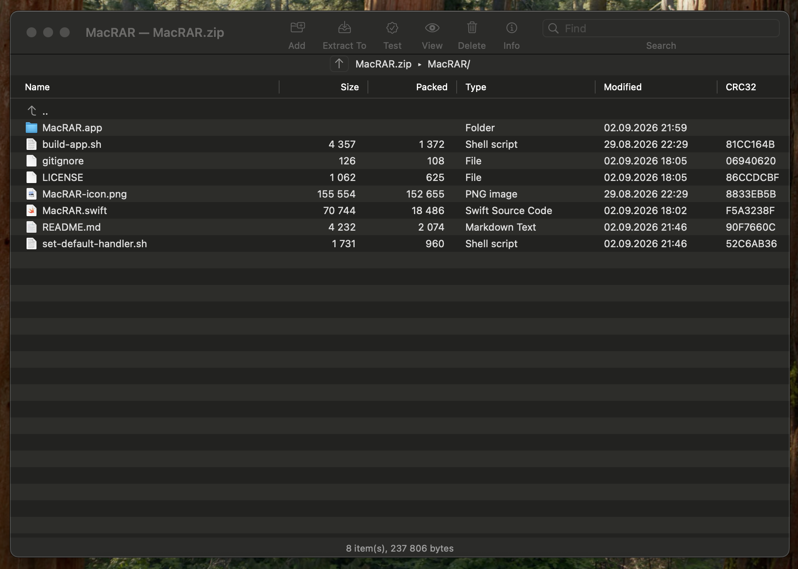

# MacRAR

A WinRAR-style archive manager for macOS. Native AppKit, a single Swift source file, no dependencies and no Xcode project — just `swiftc` and system tools.



Classic WinRAR workflow on a Mac: toolbar with Add / Extract To / Test / View / Delete / Info, a file table with Name, Size, Packed, Type, Modified and CRC32 columns, folder navigation inside the archive with a `..` entry, search, sortable columns and a status bar.

## Features

- **Browse archives without extracting** — navigate folders inside the archive, sort by any column, filter with the Find field
- **Drag & drop both ways** — drop files from Finder into the window to add them; drag entries out of the archive into Finder to extract them (folders included, via file promises — nothing is extracted until you drop)
- **Double-click to open** — files inside an archive open in their default application; archives themselves open from Finder by double-click once associated
- **Password support** — classic ZipCrypto ZIPs, encrypted 7z (including encrypted headers) and encrypted RAR; the password is asked once per session
- **Solid archives** — optional solid mode for 7z and RAR, remembered as the default
- **Clean archives** — hides `__MACOSX`, `.DS_Store` and `._*` AppleDouble files from listings, and can keep them out of archives you create, so your ZIPs look sane on Windows
- **WinRAR-style compression levels** — Store / Fastest / Normal / Best, applied across all writable formats
- **Preferences window** (⌘,) — extraction into a subfolder named after the archive, reveal in Finder, move archive to Trash after extraction, quarantine-attribute removal (kills the Gatekeeper "Apple could not verify…" warning on downloaded archives)

## Format support

| Format | List / Extract / Test | Add / Delete | Backend |
|---|---|---|---|
| ZIP | ✅ | ✅ | own central-directory parser (incl. ZIP64) + system `zip`/`unzip` |
| 7z | ✅ | ✅ with 7-Zip installed | `7zz` if installed, otherwise read-only via system `bsdtar` |
| RAR | ✅ with `unrar` | ✅ with `rar` | `unrar` / `rar` |
| tar, tar.gz, tar.bz2 | ✅ | ✅ | system `bsdtar`; add/delete work by repacking |

Optional tools (everything else works out of the box):

```sh
brew install sevenzip   # full 7z support (7zz, open source: github.com/ip7z/7zip)
brew install rar        # RAR support (proprietary; includes both rar and unrar)
```

Without them, 7z archives open read-only through `bsdtar`, and RAR archives require at least `unrar`.

## Building

Requires macOS 11+ and the Xcode Command Line Tools (`xcode-select --install`).

```sh
./build-app.sh
```

This compiles `MacRAR.swift` straight into a proper `MacRAR.app` bundle with the icon and file-type associations for .zip, .7z, .rar and the tar family. Move the bundle to `/Applications`, then right-click any archive → Open With → MacRAR (tick "Always Open With" if you want it as the default).

To make MacRAR the system-wide default for archives in one go:

```sh
./set-default-handler.sh              # zip, 7z, rar
./set-default-handler.sh --with-tar   # plus the tar family (also grabs plain .gz/.bz2)
```

For a quick unbundled build:

```sh
swiftc -O -o MacRAR MacRAR.swift
./MacRAR archive.zip
```

Note that only the `.app` bundle gets Finder integration — a bare binary launched by double-click opens Terminal, which is how macOS treats plain executables.

## Notes & limitations

- AES-encrypted ZIPs list fine but won't extract — the system `unzip` only handles classic ZipCrypto. Repack as encrypted 7z instead, it's stronger anyway.
- For 7z, per-file packed sizes are often empty: 7z groups files into solid blocks and only reports the block size. The Info dialog uses the on-disk archive size for the ratio instead.
- Adding to a solid RAR archive, and any add/delete on tar.gz/tar.bz2, involves repacking and is proportionally slow on large archives — that's the nature of the formats, not a bug.
- The app is signed ad-hoc. Gatekeeper may complain the first time you open a *downloaded* archive by double-click; either use ⌘O once, or leave the "Remove quarantine attribute" preference on and it won't recur for that file.

## License

MIT

## Notes & limitations

- AES-encrypted ZIPs list fine but won't extract — the system `unzip` only handles classic ZipCrypto. Repack as encrypted 7z instead, it's stronger anyway.
- For 7z, per-file packed sizes are often empty: 7z groups files into solid blocks and only reports the block size. The Info dialog uses the on-disk archive size for the ratio instead.
- Adding to a solid RAR archive, and any add/delete on tar.gz/tar.bz2, involves repacking and is proportionally slow on large archives — that's the nature of the formats, not a bug.
- The app is signed ad-hoc. Gatekeeper may complain the first time you open a *downloaded* archive by double-click; either use ⌘O once, or leave the "Remove quarantine attribute" preference on and it won't recur for that file.

## License

MIT
